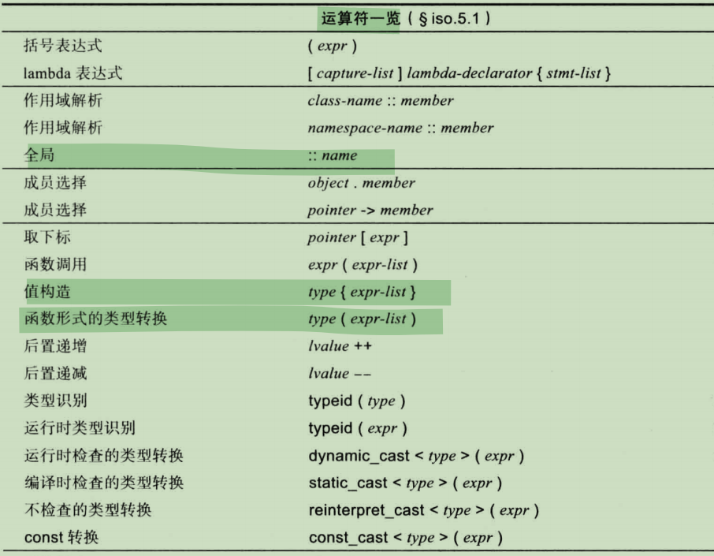
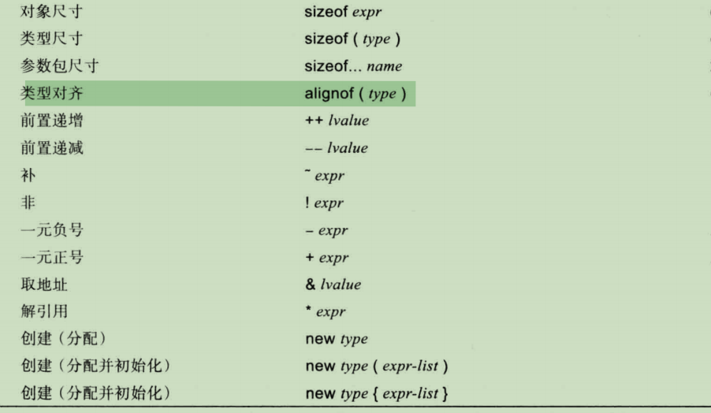
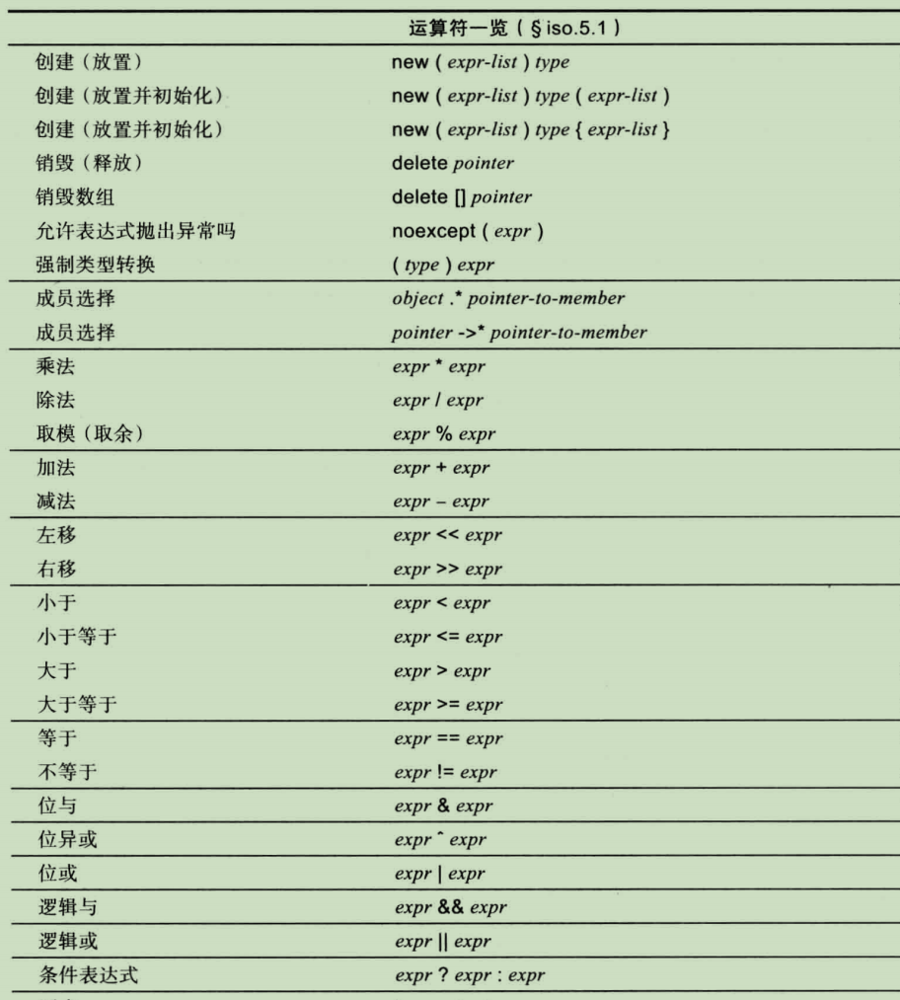
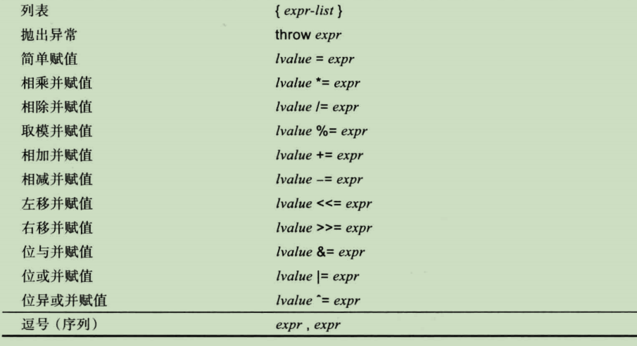
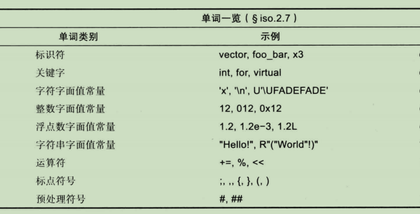
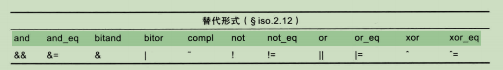

## 10.1 引言

在C++语言中，一次赋值是一个表达式，一次函数调用是一个表达式、构造一个对象是一个表达式、传统算术表达式求值之外的许多其他操作也是表达式。

## 10.2 一个桌面计算器示例

见代码 codes/chapter10_calc

### 10.3 运算符概览

表达式的语法与运算对象无关，下表列出的是当运算对象是内置类型时对应的运算符含义，此外，你也可以指定这些运算符用于用户自定义类型时的含义。









同一个方块中的运算符具有相同的优先级，运算符所在的方块位置越靠前，它的优先级越高。

后置 ++ 的优先级高于 一元 *，因此 *p++ == *(p++)

\* 的优先级高于 +，因此，a+b*c == a+(b \* c)

一元运算符和赋值运算符是右结合的，其他所有运算符都是左结合的，例如，

a=b=c的意思是 a=(b=c)，而 a+b+c 的意思是 (a+b) + c

在应用语法规则之前，先用字符构成单词。我们选择最长可能的字符序列作为单词，如&&是一个运算符，而非两个&运算符，**a++++1的意思是 (a++) + 1**。这种构词法成为最长匹配规则(Max Munch Rule)。



空格字符(如空格、制表符、换行等)能用来分隔单词，在其他情况下则被直接忽略掉。

一些逻辑运算符的替代形式



### 10.3.1 运算符的运算结果

**算术运算符**的结果类型由一组成为"常见算术类型转换"的规则决定。这些规则的基本目标是**产生"最大的"运算对象类型的结果**。

```c++
int + float = float
long + float = long
bool,char + int = int // bool,char 先转换为 int 再参与运算
```

**关系运算符的结果是布尔值**。

只要逻辑上说得通，对于**接受左值运算对象的运算符**来说，它的**结果是一个表示该左值运算对象的左值**。

```c++
void f(int x, int y) {
    int j = x = y; // x=y的值是x在执行赋值后的结果值
    int* p = &++x; // p 指向 x
    int* q = &(x++); // 错误，x++不是一个左值，它不是存储在x中的值
    int* p2 = &(x > y ? x : y); // 具有较大值的int的地址
    int& r = (x < y ? x : 1); // 错误，1不是左值
}
```

**sizeof的结果是名为 size_t的无符号整数类型**，**两个指针相减的结果是名为 ptrdiff_t 的带符号整数类型**，两者都定义在 \<cstddef\>中。

### 10.3.2&&10.3.3 求值顺序与优先级

C++没有明确规定具体的求值顺序，所以在不同的实现版本中求值顺序可能存在差异。因此，当一个表达式中包含的运算符太多时，我们要用括号把表达式的某一部分强行结合在一起。

### 10.3.4 临时对象

通常，编译器必须**引入一个对象，用以保存表达式的中间结果**。例如，对于表达式 v = x+y\*z，再把y\*z的结果加到x上之前必须暂时存在某处。内置类型使用临时对象(temporary object)实现上述要求，并且该临时对象是用户不可见的。**除非我们把临时对象绑定到引用上或者用它初始化一个命名对象，否则大多数时候在临时对象所在的完整表达式末尾，它就会被销毁。完整表达式不是任何其他表达式的子表达式。**

**临时对象可以用作const引用或者命名对象的初始化器。**

**切记视图返回局部变量的引用，并且也不允许把一个临时变量绑定到非const左值引用上。**

## 10.4 常量表达式

C++提供了两种与“常量”有关的概念：

* constexpr：编译时求值，启用并确保编译时求值
* const：在作用域内不改变其值，主要作用是在接口中规定某些成分不可修改

常量表达式(constant expression)是指 由编译器求值的表达式。它不能包含任何编译时未知的值，也不能具有其他副作用。一条常量表达式由整数值、浮点数值或者枚举值等成分构成，可以用运算符或者生成常量值的constexpr函数把这些基本成分组合在一起。

如果constexpr的初始化器无法在编译时求值，则编译器会报错

```c++
int x1 = 7;
constexpr int x2 =7;
constexpr int x3 = x1; // 错误，初始化器不是常量表达式
constexpr int x4 = x2; // OK
```

常量表达式的表达能力异常丰富，我们可以使用整数、浮点数和枚举值，还可以使用任何不会修改状态的运算符(如+-?:和[]等，=和++不行)。

在编译时计算某个整数的平方根

```C++
constexpr int isqrt_helper(int sq, int d, int a) {
    return sq <= a ? isqrt_helper(sq+d, d+2, a) : d;
}

constexpr int isqrt(int x) {
    return isqrt_helper(1, 3, x) / 2 - 1;
}
constexpr int s1 = isqrt(9); // s1==3
```

constexpr函数有时被用作常量表达式，有时又不是。

### 10.4.1 符号化常量

常量(constexpr或const值)最重要的一个用处时**为值提供符号化的名字**。避免出现**魔法数字**。

### 10.4.2 常量表达式中的const

const常用于表示接口。同时也可以表示常量值。

以常量表达式初始化的const可以用在常量表达式中。与constexpr不同的是，const可以用非常量表达式初始化，但是此时该const将不能用作常量表达式。

```c++
const int x = 7;
const string s = "hello world";
const int y = sqrt(x);
constexpr int xx = x; // OK
constexpr string ss = s; // 错误，s不是常量表达式，string不是字面值常量类型
constexpr int yy = y; // 错误，sqrt(x)不是常量表达式，sqrt()不是一个constexpr函数
```

当定义简单的变量时，constexpr比const好。

枚举值很多时候可以替代const。

### 10.4.3 字面值常量类型

在常量表达式中可以使用简单的用户自定义类型，例如：

```c++
struct Point {
    int x, y, z;
    constexpr Point up(int d) { return x, y, z+d; }
}
```

含有 constexpr 构造函数的类称为字面值常量类型(literal type)。构造函数必须足够简单才可能声明成constexpr，它的函数体必须为空，且所有成员都是用潜在的常量表达式初始化的。

### 10.4.4 引用参数

当你使用constexpr时，谨记constexpr是一个关于值的概念。任何对象都无法改变值或造成其他什么影响：constexpr实际上提供了一种微型的编译时函数式程序设计语言。const引用也能作为constexpr函数的参数。

### 10.4.4 地址常量表达式

全局变量等静态分配的对象的地址是一个常量，然而该**地址是由链接器赋值**的而非编译器。因此，编译器并不知道这类地址常量的值到底是多少。

```c++
constexpr const char* p1 = "hello";
constexpr const char* p2 = p1; // OK
constexpr const char* p3 = p1+2; // 错误，编译器不知道p1本身的值是多少
constexpr char c = p1[2]; // OK,编译器知道p1所指的值
```

## 10.5 隐式类型转换

在赋值语句、表达式以及参数传递等过程中，值的类型可能会发生自动转换，不幸的是，可能会发生某些隐式的损失值(窄化)的类型转换(窄化类型转换,narrowing conversion)。

### 10.5.1 提升

保护值不被改变的隐式类型转换成为提升(promotion).

在执行算数运算之前，通常先把较短的整数类型通过整型提升成int。

### 10.5.2 类型转换

基本类型之间可能发生各种各样的隐式类型转换，使用{}列表能防止窄化计算的发生。

```c++
void f(double d) {
    char c = d; // OK,但会发生窄化
    char c2{d}; // 错误，编译器会发现窄化现象
}
```

如果窄化无法避免，可以考虑运行时类型转换 narrow_cast<>

#### 10.5.2.1 整数类型转换

整数能被转换成其他整数类型。一个普通的枚举类型值也能转换成等值的整数类型。

#### 10.5.2.3 指针和引用类型转换

任何指向对象类型的指针都能隐式的转换成void\*(**指向函数的指针和指向成员的指针不能隐式的转换成void\***)。

**指向 派生类的指针(或引用) 能隐式地转化成 指向其可访问的且明确无二义的基类的指针(或引用)。**

T\*可以隐式的转换成 const T\*, T& 也能隐式地转换从 const T&。

求值结果为0的常量表达式能隐式地转换成任意指针类型的空指针，

求值结果为0的常量表达式也能隐式地转换成指向成员的指针类型

```c++
int*p = (1+2)*(2*(1-1)); //OK
```

但**最好直接使用nullptr**。