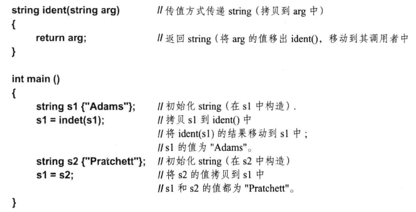
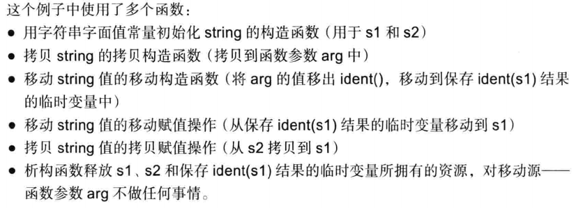
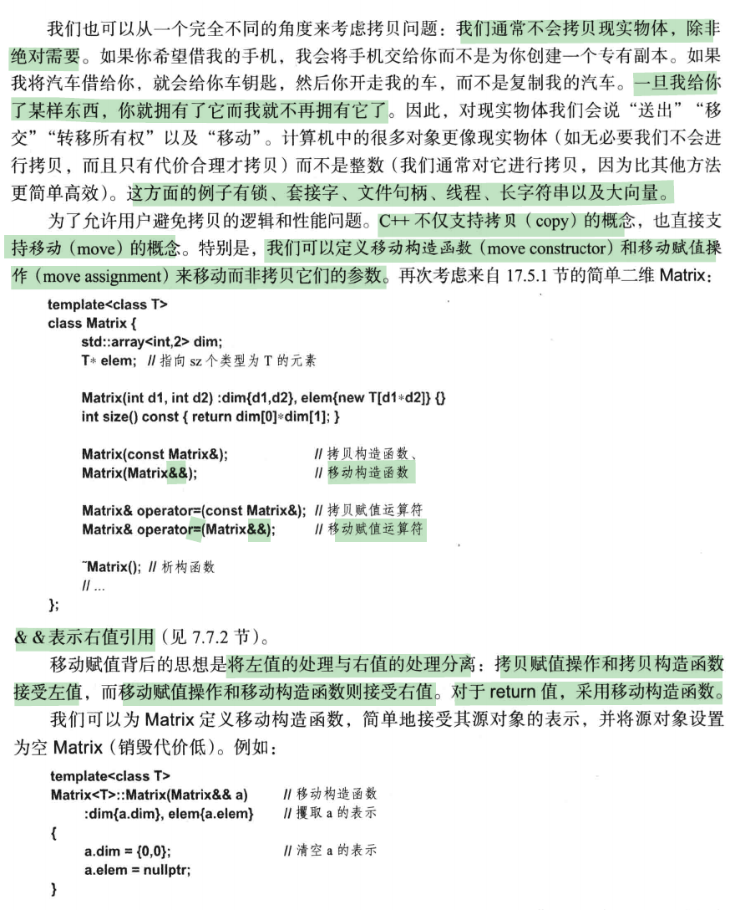
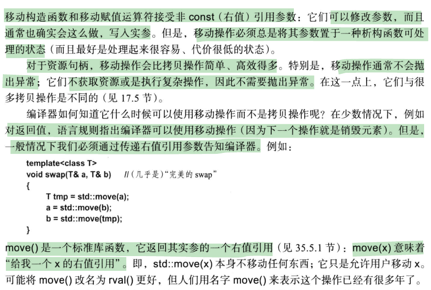

 

## 17.1 引言

本章主要介绍与对象“生命周期”有关的技术：即如何创建对象、如何拷贝对象、如何移动对象以及在对象销毁时如何进行清理工作。如这样一个例子：





移动(move)和拷贝(copy)的区别在于，**拷贝操作后两个对象具有相同的值，而移动操作后移动源不一定具有其原始值**。如果源对象在操作后不再使用，就可以使用移动操作。在实现资源移动概念时，移动操作特别有用。

一个对象在6种情况下会被拷贝或移动：

* 作为赋值操作的源
* 作为一个对象初始化器
* 作为一个函数实参
* 作为一个函数返回值
* 作为一个异常

构造、拷贝和移动赋值以及析构函数直接支持生命周期和资源管理的视角。它们在逻辑上不是相互独立的。这组函数必须相互匹配，否则就会引起逻辑问题或性能问题。

除了“普通构造函数”，这些特殊成员函数都可以由编译器自动生成。

### 17.2 构造和析构函数

#### 17.2.1 构造函数与不变式

构造函数的任务是初始化该类的一个对象。一般而言，**初始化操作必须建立一个类不变式(class invariant)**，所谓的不变式就是当成员函数(从类外)被调用时必须保持的某种东西。

```c++
class Vector {
public:
	Vector(int s);
    // ...
private:
    double* elem;
    int sz;
}
```

在上例中，elem指向一个数组，保存sz个双精度浮点数以及sz非负。构造函数必须g保证这亮点为真。

#### 17.2.2 析构函数与资源

构造函数创建供成员函数操作的环境。创建环境有时需要获取资源，如文件、锁或内存，这些资源在使用后必须释放。析构和构造互补，在对象销毁时保证被调用，进行一些清理工作并释放资源。

```c++
class Vector {
public:
	Vector(int s): elem{new double[s]}, sz{s}{};
    ~Vector() {delete[] elem;}
    // ...
private:
    double* elem;
    int sz;
}
```

这种基于构造/析构的资源管理风格被成为资源获取即初始化(RAII)

#### 17.2.3 基类和成员析构函数

构造函数和析构函数i可以很好地与类层次配合。构造函数会“自顶向下”创建一个类对象：

1. 首先，构造函数调用其基类的构造函数
2. 然后，调用成员的构造函数
3. 最后，执行自身的函数体

析构函数则按相反顺序“拆除”一个对象。

特别是，一个virtual基类必须在任何可能使用它的派生类 之前构造，并在它们之后销毁。

构造函数**按声明顺序(而非初始化器顺序)**执行成员和基类的构造函数。因为如果两个构造函数使用了不同的顺序，析构函数不能保证按构造的相反顺序进行销毁。

#### 17.2.4 调用构造和析构

当对象退出作用域或被delete释放时，析构函数会被隐式调用。

当然我们可以通过声明X的析构函数为=delete或private(更灵活)，就可以阻止器析构。


#### 17.2.5 virtual析构函数

析构函数可以声明为virtual，而且对于含有虚函数的类通常就应这么做。原因是，如果是通过基类提供的接口操纵一个对象，也应通过此结构来delete它。

### 17.3 类对象初始化

#### 17.3.1 不使用构造函数进行初始化

我们可以用下列方法初始化一个**无构造函数的类的对象**：

* 逐成员初始化
* 拷贝初始化(逐成员复制)
* 默认舒适化(**空初始化器列表**或不用初始化器)

```c++
struct Work{
  string c;
  int a, b;  
};

Work s1 {"123", 1, 2}; //逐成员初始化
Work s2{s1}; //拷贝初始化
Work none{}; // 默认舒适化**空初始化器列表**
```

当然也可以省去初始化器

```c++
Work alpha;
void f() {
    Work beta;
}
```

**对于静态分配的对象**，这种初始化方式与使用{}完全一样，因此alpha的值是{"", 0, 0}。**但是对于局部变量和自由存储空间对象，只对类类型的成员进行默认初始化，内置类型的成员是不进行初始化的**，因此beta的值是{"", unknown, unknown}。

所以建议提供初始化器，如{}。

**如果一个类有私有的非static数据成员，它就需要一个构造函数来进行初始化。**

**引用和const必须被初始化**。因此，一个包含这些成员的类不能默认构造，除非提供了类内成员初始化器或定义了一个默认构造函数来初始化它们。

### 17.4 成员和基类初始化

构造函数可以创建不变式并获取资源。一般是通过初始化类成员和基类来完成这些工作的

#### 17.4.1 成员初始化

```c++
class Club {
  	string name;
    vector<string> members;
    Date founded;
    
    Club(cosnt string& n, Date fd);
};

// 通过成员初始化器列表(member initializer list)给出成员的构造函数的参数
Club::Club(cosnt string& m, Date fd)
    : name{n}, members{}, founded{fd}
{
    // ...
}
```

成员初始化器列表是以一个毛好开始，后面的成员初始化器用逗号间隔。

类自身的构造函数在其函数体执行之前会先调用成员的构造函数**。成员的构造函数按在类中声明的顺序调用而非在列表中出现的顺序**。

一个“隐式初始化”的内置类型成员其实是未初始化的。一个构造函数可以初始化类的成员和基类，但不会初始化其成员或基类的成员或基类。

引用和const成员必须初始化。

#### 17.4.2 基类初始化器

派生类的基类的初始化方式与非数据成员相同。即，如果基类要求一个初始化器，就必须在构造函数中提供相应的基类初始化器。与成员初始化类似，基类按声明顺序进行初始化。

#### 17.4.3 委托构造函数

如果希望两个构造函数做相同的操作，可以重复代码，也可以定义一个“init()函数”执行两者相同的操作。

但会影响可读性，和可维护性。一种替代方案是用一个构造函数定义另一个：

```c++
class X {
  	int a;
public:
    X(int x) { if (x>0 && x<=max) a=x; else throw Bad_X(x);}
    // 委托构造函数(转发构造函数),调用另一个构造函数作为这个构造过程的一部分。
    X(): X{42}{}
    X(string s): X(to<int>(s));
    
    // 不能同时显式和委托初始化一个成员
    X(): X{42}, a{56} {} // 错误
    
    // 委托与 在构造函数体中显式调用其他构造函数有很大不同
    X(){ X{42}; } // 只是简单的创建了一个新的临时对象，对它 不作任何处理。
};
```

#### 17.4.4 类内初始化器

可以在类声明中为非static数据成员指定初始化器。

```c++
class A{
public:
    int a{7};
    int b = 77; // 7的意志！！！！
};
// {}和=语法能用于类内成员初始化器，但()语法不行
```

#### 17.4.5 static成员初始化

static类成员是静态分配的，而不是每个类对象的一部分。static成员声明充当类外定义的声明。

```c++
class Node{
  // ...
    static int node_count;// 声明
    
    // 当且仅当，static成员 是整形或枚举类型的const，或字面值类型的cosntexpr，
    // 且 初始化器必须是一个常量表达式
    static const int a = 1; // ok
    static int c2 = 11; // error: 非const
    static const float c3 = 7.0; // error：不是整型，应使用constexpr而非const
    static cosnt int c4 = sqrt(9); // error： 初始化器不是常量
};
int Node::node_count = 0;// 定义
```

### 17.5 拷贝和移动

当我们从a到b传输一个值的时候，通常有两种做法：

* 拷贝是x=y的常规含义：结果是x和y都等于u赋值前y的值。
* 移动：将x变为y的旧值，y变为某种移出状态

一般来说，移动不能抛出异常，而拷贝可以(因为拷贝可能需要获取资源)，移动通常比拷贝更高效。

#### 17.5.1 拷贝

类X的拷贝操作有两种：

* 拷贝构造函数：X(const X&)
* 拷贝赋值运算符：X& operator=(const X&)

区别在于前者初始化一片未初始化的内存，而后者必须正确处理目标对象已构造并可能拥有资源的情况。

一个拷贝构造函数通常需要拷贝每个非static成员。

拷贝操作必须满足两个准则：

* 等价性：在x=y后，对x和y执行相同的操作应得到相同的结果
* 独立性：在x=y后，对x的操作不会隐式地改变y的状态

#### 小心默认拷贝操作

默认拷贝操作执行逐成员拷贝，因此会拷贝指针成员，但不会拷贝指针指向的对象(浅拷贝)，一次浅拷贝会令两个对象进入共享状态，纠缠在一起**。编写一个拷贝操作时，应确保拷贝了每个基类和成员。**

#### 切片

一个指向派生类的指针可隐式转换成为指向器共有基类的指针。所以在应用到拷贝操作时，会导致一个陷阱。

```c++
struct Base {
  	int b;
    Base(const Base&);
};

struct Derived: Base {
  	int d;
    Derived(cosnt Derived&);
};

void naive(Base* p){
    Base b2 = *p; // 可能切片：调用 Base::Base(const Base&)
    
    
}

void user() {
    Derived d;
	naive(&d);
    Base bb = d; //切片：调用Base(const Base&)而非Derived(const Derived&)
}
```

变量b2和bb包含d的Basen部分的副本，即d.b的副本。成员d.d不会被拷贝。这就是切片现象。

防止：

* 禁止拷贝基类：delete拷贝操作
* 防止派生类指针转换为基类指针：将基类声明为private或protected基类

#### 17.5.2 移动

有些时候我们其实不希望做任何拷贝：**我们只是希望交换一对值(移动)。**





### 17.6 使用delete删除函数

我们可以删除一个函数; 即，我们可以声明一个函数不存在，从而令(显式或隐式)调用成为错误。最明显的应用是消除其他默认函数，例如防止拷贝基类。

```c++
class B {
  	Base& operator=(const Base&) = delete; //不允许拷贝
    Base(const Base&) = delete;
    
    Base& operator=(Base&&) = delete; //不允许移动
    Base(Base&) = delete;
};

Base x;
Base x2{x1}; // error：没有拷贝构造函数
```

我们可以使用delete删除任何我们能声明的函数：

将一个特例化版本从函数模板众多特例化版本中删除：

```c++
template<class T>
T* clone(T* p) {
    return newT{*p};
}
Foo* clone(Foo*) = delete;
void f(Shape* ps, Foo* pf) {
    auto* p2 = clone(ps); //ok
    auto* pf2 = clone(pf); // error
}
```

