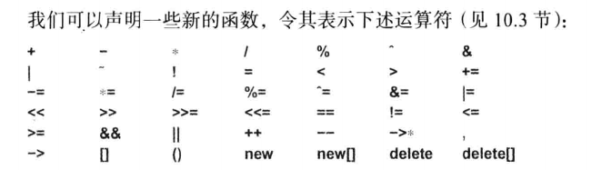

 

## 18.1 引言

为类定义运算符，而非基本形式的函数，可以帮助程序员**以更符合常规的方式便捷地操作类的对象。**

### 18.2 运算符函数

此外用 operator"" 表示用户定义的字面值常量。operator T()表示向T的类型转换。

但是，用户无权定义下列运算符：

* :: 作用域解析
* . 成员选择
* .* 通过指向成员的指针访问成员

这3种运算接受一个名字而非一个值作为其第二个运算对象，主要作用是指向或者引用成员。

下列具名运算符负责报告其运算对象的某些基本情况，因此也不难被重载：

* sizeof 对象的尺寸
* alignof 对象的对齐方式
* typeid 对象的type_info

最后，三元条件表达式也不能被重载:

* ?:

## 18.3 友元

一条普通的成员函数声明语句在逻辑上包含互相独立的三层含义：

1. 该函数有权访问类的私有成员
2. 该函数位于类的作用域内
3. 必须拥有一个含有this指针的对象调用该函数

通过将成员函数声明为static，可以令它只具有前两层含义。通过把非成员函数声明为friend，可以令 它只具有第一层含义。