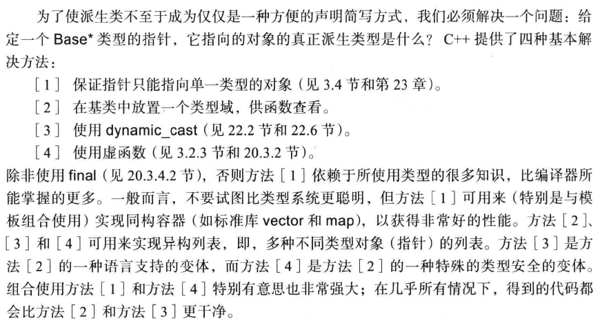
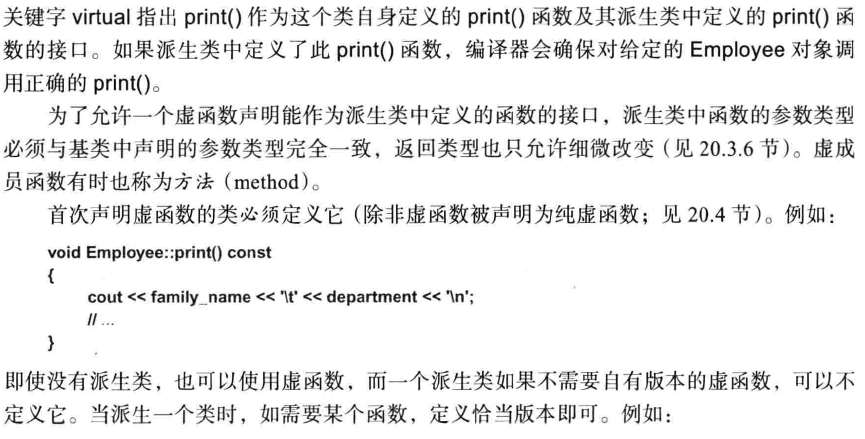
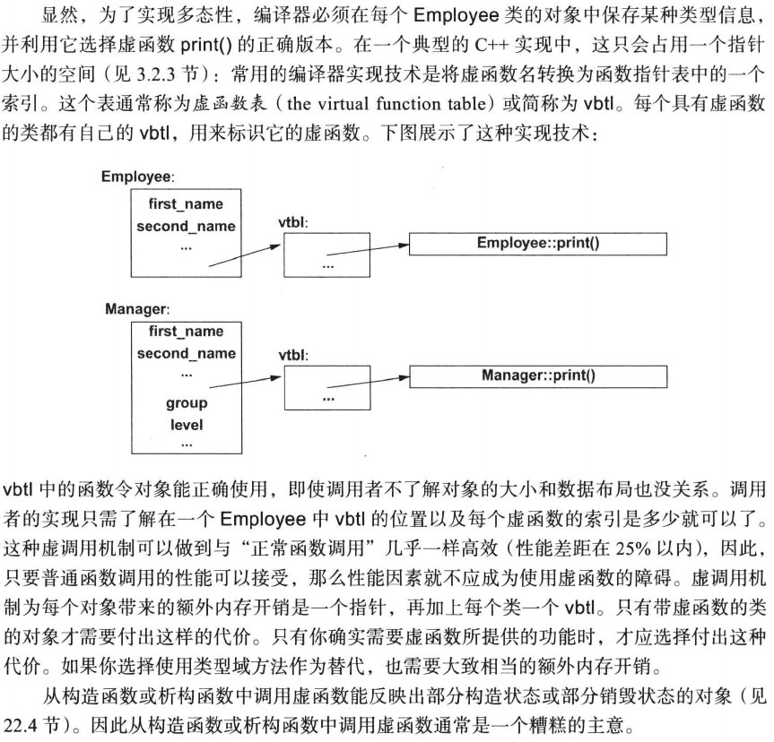
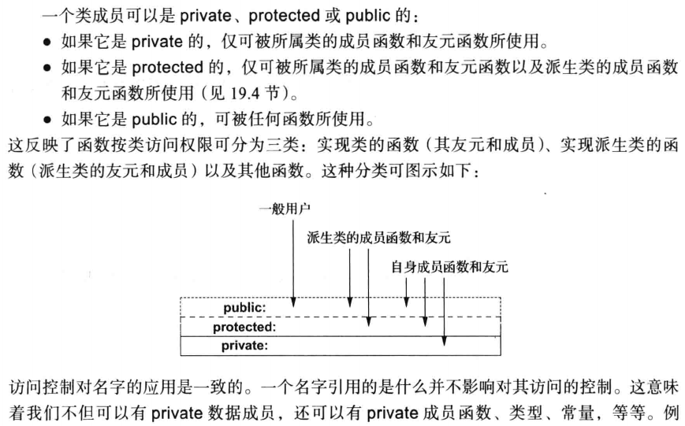

## 19.1 引言

类应该用来建模程序员和应用程序世界中的思想。任何一个概念都不是孤立存在的，都有与之共存的相关概念。

C++提供了派生类的概念及相关语言机制来表达层次关系，即，表达类之间的共性。

C++特性支持从已有类构建新的类：

* 实现继承(implementation inheritance)：通过共享基类所提供的特性来减少工作量。(虚函数)
* 接口继承(interface inheritance)：通过一个公共基类提供的接口允许不同派生类互相使用。(纯虚函数)

接口继承常被称为运行时多态(run-time polymorphism)。相反，模板所提供的类的通用性与继承无关，被称为编译时多态(compile-time polymorphism)。

## 19.2 派生类

派生类继承了来自基类的属性，这种关系也被称为继承(inheritance)。基类也称为超类，派生类称为子类。但派生类对象中的数据是其基类对象数据的超集。一个派生类通常比基类保存更多数据、提供更多函数。

如果一个类Derived有一个公有基类Base，那么我们可以将一个Derived*赋予一个Base*类型的变量而无须显式类型转换。相反的转换必须是显式的。换句话说，若通过指针和引用进行操作，派生类对象可以当作其基类对象处理，反过来则不能。


**派生类的成员可以使用基类的公有和保护成员,就好像它们声明在派生类中一样。但派生类不能访问基类的私有成员。**

## 19.3 类层次

一个派生类自身也可作为其他类的基类。如：

```c++
class A{};
class B: public A{};
class C: public B{};
```

我们称这样一组相关的类为类层次(class hierarchy)。

### 19.3.1 类型域



### 19.3.2 虚函数

虚函数机制允许程序员在基类中声明函数然后在每个派生类中重新定义这些函数。从而解决了类型域方法的固有问题。编译器和连接器会保证对象和施用于对象之上的函数之间的正确关联。如

```c++
class Employee {
public:
    Employee(const string& name, int dept);
    virtual void print() const;
    
private:
    string first_name, family_name;
    short department;
};
```



如果派生类中一个函数的名字和参数类型与基类中的一个虚函数完全相同，则称它覆盖了虚函数的基类版本。

在C++中为了获得运行时多态行为，必须调用virtual成员函数，对象必须通过指针或引用进行访问。当直接操作一个对象时，编译器了解器确切类型，从而就不需要运行时多态。



### 19.3.3 显式限定

使用作用域解析运算符:: 函数能保证不使用virtual机制：

```c++
void Manager::print() const {
    Empolyee::print(); // 不是一个虚调用，否则Manager::print()会面临无限递归
}
```

### 19.3.4 覆盖控制

如果你在派生类中声明了一个函数，其名字和类型都与基类中的一个虚函数完全一样，则这个函数就覆盖了基类中的版本。

但对大型类层次，若想实现正确的覆盖，就要用到特定的控制机制：

* virtual：函数可能会被覆盖
* =0：函数必须是virtual的，且必须被覆盖
* override：函数要覆盖基类中的一个虚函数
* final：函数不能被覆盖

**如果不使用这些覆盖控制，一个非static成员函数为虚函数当且仅当它覆盖了基类中的一个virtual函数。否则很有可能只是隐藏掉基类的同名函数。**

override和final都是一个上下文关键字(contextual keyword)。即，在某些上下文有特殊含义，但在其他地方可用作标识符。

virtual和override最好的使用方式是前者只用来引入新的虚函数，而后者指出函数要覆盖某个虚函数。

### 19.3.5 using 基类成员

函数重载不会跨作用域。

```c++
struct Base {
  	void f(int);  
};

struct Derived: Base {
  	void f(double);  
};

void use(Derived d) {
    d.f(1); // Derived::f(double), 找不到 Base::f(int)
    Base& br = d;
    br.f(1); // Base::f(int)
}

// 我们可以用using声明将一个函数加入作用域中
struct D2: Base {
  	using Base::f;
    void f(double);
};
void use2(Derived d) {
    d.f(1); // Base::f(int)
    Base& br = d;
    br.f(1); // Base::f(int)
}
```

我们可使用多个using声明从多个基类引入名字。

我们还可以将构造函数引入派生类作用域，称为继承构造函数

```c++
struct B1 {
  	B1(int){}  
};

struct D1: B1 {
    using B1::B1; // 等价于 D1(int i): B1(i) {}
    string s; // 有默认构造
    int x{7};
}

void test() {
    D1 d{7};
}
```

**最好仅对不增加数据成员的简单情况使用继承构造函数**。

### 19.3.6 返回类型放松

覆盖函数的类型必须与它所覆盖的虚函数的类型完全一致，C++对这一规则提供了一种放松规则。即，如果源函数返回类型i为B\*，则覆盖函数的返回类型可以为D\*，只要B是D的一个公有基类既可。称为协变返回规则(covariant return)。

这一规则只能用于返回类型是指针或者引用的情况，但不能是unique_ptr这样的智能指针，特别是对参数类型没有类似的放松规则。

## 19.4 抽象类

具有一个或多个纯虚函数的类称为抽象类，我们无法创建抽象类的对象。

抽象类就是要作为通过指针和引用访问的对象的接口(为保持多态行为)。因此，对一个抽象类来说，定义一个虚析构函数非常重要。由于抽象类提供的接口不能用来创建对象，因此抽象类通常没有构造函数。

抽象类提供接口，但不暴露实现细节。

纯虚函数：通过使用 伪初始化器=0可将一个虚函数提纯。

```c++
class Shape {
public:
    virtual void rotate(int) = 0; // h纯虚函数
};
```

如果纯虚函数在派生类中未被定义，那么它仍是纯虚函数，因此派生类也是一个抽象类。

抽象类锁支持的设计风格称为接口继承。

## 19.5 访问控制



