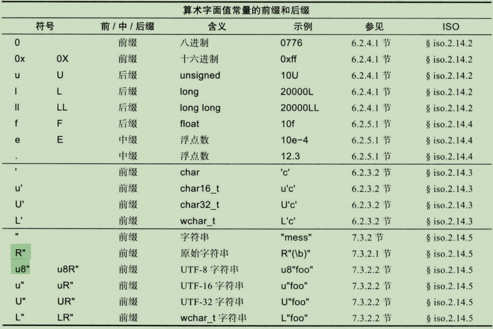

## 6.1 ISO C++标准

在c++标准下，很多功能都依赖于实现(implementation-defined)，例如下面的语句：

```c++
unsigned char a = 64; // 定义良好
unsigned char b = 1256; // 依赖于实现
```

由于char占多少位在不同的实现版本中可能不一样，如果char只占8位，则1256则会被截断为**232?**。大多数依赖于实现的功能都与运行程序的硬件系统密切相关。

因此，标准库提供了 **numeric_limits**，可以让我们通过设置静态断言的方式检查某些特性是否确实依赖于实现。

```c++
static_assert(4 <= sizeof(int), '****');
```

### 6.1.1 实现

c++具体有两种实现形式：宿主式和独立式，宿主式包含所有标准库功能，而独立式功能可能会少一些，因此常被用在只提供最基本功能的操作系统功能的环境中。


### 6.1.2 基本源程序字符集

c++标准都是基于 **基本源程序字符集**写成的，该字符集为ASCII字符集。

## 6.2 类型

C++中每个标识符都对应一种数据类型，该类型决定了这个标识符所对应的实体能执行哪些运算以及如何执行这些运算。

### 6.2.1 基本类型

C++包含一套基本类型(fundamental type)，这些类型对应计算机最基本的存储单元并且展现了如何利用这些单元存储数据。

* 基本类型：
  * 布尔值类型
  * 字符类型
  * 整数类型
  * 浮点数类型
  * void类型(表示类型信息缺失)
* 通过作用声明符在基本类型，可构造更多类型：
  * 指针类型
  * 数组类型
  * 引用类型
* 用户自定义类型(用户必须先定义才能使用)：
  * 数据结构和类
  * 枚举类型

把 **基本类型、指针和引用**统称为**基本类型**。

布尔、字符和整数统称整型。

整型和浮点 为算术类型。

### 6.2.2 布尔值

bool取值范围为 true 或 false,常用语表示 逻辑运算的结果，此外 指针也能被隐式的转换为bool，非空指针对应true，nullptr的指针为false，常用 if(p)来判断指针是否为空。

### 6.2.3 字符类型

* char：默认的字符类型
* signed char,unsigned char: 有符号的char
* wchar_t：存放Unicode等更大的字符集。
* char16_t：utf-16
* char32_t：utf-32

**需要注意的是char类型在具体的实现版本中，可能会和signed char 或 unsigned char 完全等效，因此，在使用 char 的时候要避免使用负值。**

#### 6.2.3.2 字符字面值常量

字符字面值常量是指 单引号内的一个字符，如'a'或'0'。数据类型是 char。

转义字符


### 6.2.4 整数类型

* int, unsigned int, signed int
* short = short int
* long = long int
* long long = long long int

如果需要更精细的控制整数的尺寸，可以使用\<cstdint\>中定义的别名入int64_t等。

#### 6.2.4.1 整数字面值常量

整数字面值常量分为 十进制、八进制、十六进制。

八进制以0开头，十六进制以 x或 X开头


不要滥用定义不明显的常量，最好只在给const、constexpr和枚举赋初值时使用。

### 6.2.5 浮点数

浮点数是实数在有限内存空间上的一种近似表示，有三种浮点数类型：

* float
* double
* long double

默认情况下，浮点数字面值常量是double，可通过加后缀的方式解决。

### 6.2.6 前缀和后缀

用来限定字面值常量的类型



### 6.2.7 void

void有两个作用

* 作为函数的返回类型用以说明函数不返回任何实际值
* 作为指针的基本类型部分说明指针所指的对象类型未知

当我们声明函数时，必须指定返回类型。

## 6.3 声明

在C++中要想使用某个标识符，必须对其先进行声明，换句话说，我们必须制定它的类型以便编译器知道这个标识符对应的是何种实体。

**标识符的规范，一个标识符包含若干字母和数字，第一个字符必须是字母，下划线_ 也看成是字母，以下划线啊开头的非局部名字表示具体实现及运行时环境中的某些特殊功能，应用程序中不应使用这样的名字，此外，标识符的命名区分大小写。**

声明语句的作用不止把类型和标识符关联起来这么简单，大多数声明同时也是定义，可以把定义看成是一种特殊的声明，提供了在程序中使用该实体所需的一切信息，有其是实体需要内存空间来存储某些信息时，定义语句会把所需的内存预留出来。

**注意，每个标识符可以对应多个声明语句，但是只能有一个定义，而在同一实体的所有声明中，实体的类型必须保持一致。**

一条声明语句依次包含5个部分：

* 可选的前置修饰符（如static和virtual）
* 基本类型（如vector\<int\>, const int）
* 可选的声明符，可包含一个名字 （如p[7],n和\*(\*)[]）
* 可选的后缀函数修饰符（如const和noexcept）
* 可选的初始化器或函数体

修饰符是指 声明语句中最开始的关键字， 修饰符的作用是指定所声明对象的某些非类型属性。


**声明语句中 不允许 省略 数据类型**

```c++
const c = 7; // 错误，缺少数据类型		
```

### 6.3.4 作用域

声明语句为作用域引入一个新的名字，即，某个名字只能在程序文本中的某个特定区域使用。

* 局部作用域：函数或lambda表达式中声明的标识符成为局部名字。作用域从声明处开始到声明语句所在的块结束为止，其中块 是指一对｛｝包围的代码片段。函数和lambda的参数也是其中的局部名字。
* 类作用域：若某个类位于任意函数、类、枚举类或其他名字空间外部，则定义在此类找那个的名字成为成员名字。类成员名字的作用域从类的声明的｛开始，到类的声明的结束为止。
* 名字空间作用域：// TODO
* 全局作用域：定义在任意函数、类、枚举类和名字空间之外的名字成为全局名字，作用域从声明处开始到声明语句所在的文件末尾为止。全局名字能被其他单元访问。通常使用 ::x 来访问 全局的 x，防止与局部冲突。
* 语句作用域：定义在for while if 和switch语句中的（）部分，作用域从声明处开始，到语句结束为止。
* 函数作用域：从声明开始到函数体结束。

在块内声明的名字能隐藏外层块及全局作用域中的同名声明，即隐藏名字现象。

### 6.3.5 初始化

初始化器就是对象在初试状态下被赋予的值，有四种可能的形式：

```c++
X a1{v};
X a2 = {v};
X a3 = v;
X a4(v); // 调用类的构造函数进行初始化
```

只有第一种不受任何限制，在所有场景中都能使用。

使用**{}** 的初始化成为列表初始化，能防止窄化转换，即：

* 如果一种整型 存不下 另一种整型，则后者不会被转化成前者。 (布尔、字符和整数统称整型)
* 浮点型同上。
* 浮点型不能转换成整型。
* 整型不能转换成浮点型。

注意：

当我们使用auto关键字从初始化器推断变量的类型时，没必要采用列表初始化方式。

```c++
auto z1 {99}; // z1 会被推断为 initalizer_list<int>
```

当使用auto的时候，应当选择 = 的初始化方式。

空初始化器列表 {} 指定使用默认值进行初始化。

当缺少初始化器的时候，全局变量、名字空间变量、静态对象(局部static和static成员)将会执行相应数据类型的列表 {} 初始化。

对于局部变量和自由存储上的对象(动态对象或堆对象)，除非他们位于用户自定义类型的默认构造函数中，否则不会执行默认初始化。

### 6.3.6 auto 和 decltype

* auto: 根据对象的初始化器推断对象的数据类型，我们还可以为推断出的类型添加修饰符或说明符，注意，表达式的类型永远不会是引用类型，因为表达式会隐式地执行解引用操作。

  ```c++
  for (const auto& x: v){} // x const int&
  ```

  

* decltype(expr): 推断的对象不是简单的初始化器，可能是函数的返回类型或者累成员的类型，推断的结果是expr的声明类型。

## 6.4 对象和值

对象(object)是指内存中一块连续的存储区域。

### 6.4.1 左值和右值

在考虑对象的寻址、拷贝、移动等操作时，有两个属性非常关键：

* 有身份：在程序中有对象的名字，或指向该对象的指针，或该对象的引用，这样就能判断两个对象是否相等或者对象的值是否发生了变化。
* 可移动：能把对象的内容移动出来，把它的值移动到其他某处，剩下的对象处于合法但未指定的状态，与拷贝是有差别的。

两个属性的四种组合形式中，有三种需要描述(既没有身份又不能移动的对象不重要)，用 m 表示可移动，i 表示有身份，从而把表达式的分类表示成如下图所示的形式：


一个经典的左值 有身份 但不能移动，因为我们可能会在移动后仍然使用它。

而一个经典的右值是 允许执行移出操作的对象。

一条表达式要么是左值要么是右值。

### 6.4.2 对象的生命周期

对象的生命周期从对象的构造函数完成那一刻开始，直到析构函数执行为止。对于没有声明构造函数的类型(比如int)，可认为有默认的构造和析构函数。

从生命周期的角度可把对象分成以下类别：

* 自动对象(automatic)：分配在栈空间上，每调用一次函数，获取新的栈帧以存放它的自动对象。超出作用域时被销毁。
* 静态对象(static)：在全局作用域 或 名字作用域 中声明的对象 以及 在函数 或 类中声明的static成员只被创建并初始化一次，直到程序结束之前都存活。在程序的整个执行周期内地址唯一。且所有的线程都共享静态对象，所以在多线程环境中，必须为其加锁以避免数据竞争。
* 自由存储对象(free store)：用new 和 delete 直接控制其生命周期的对象。
* 临时对象(temporary)：比如计算的中间结果等，通常也是自动对象。
* 线程局部对象(thread-local)：生命为thread_local的对象，随线程共存亡。

## 6.5 类型别名

为某种类型起个新名字(可能是由于原名字太复杂、太长，方便后期维护)

有两种实现方式 typedef 和 using.

```c++
typedef int int32_t; // == using int32_t = int;
typedef void(*PtoF)(int); // == using PtoF = void(*)(int);
```

可以看到，使用typedef时要把声明的类型别名放在一般声明语句中变量所在的位置上。

注：不允许在类型别名前添加修饰符，如：

```c++
using Char = char;
using Uchar = unsigned Char; // 错误
using Uchar = unsigned char; // ok
```

类型别名不代表一种新类型，只是某种已有类型的同义词，如果想实现一种新类型，并且它的语义和表达式形式与某种已有类型一致，应该使用  枚举 或者类。

